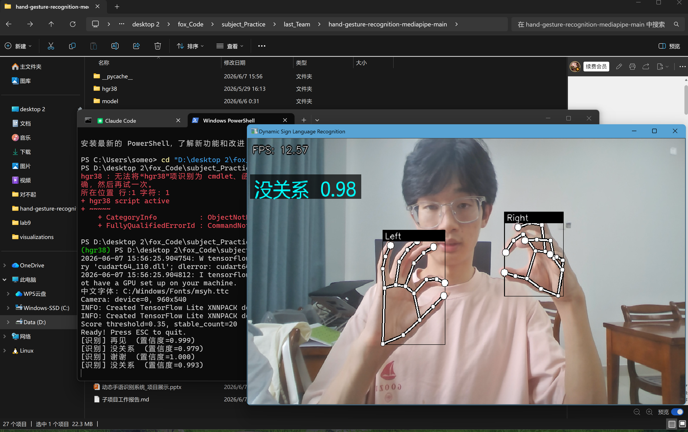

# 动态手语识别系统 (Dynamic Sign Language Recognition)

基于 MediaPipe + TensorFlow Lite 的**实时动态手语识别**，支持 10 种中文手语词，专为 PC 和树莓派部署设计。

> 原始项目: [hand-gesture-recognition-using-mediapipe](https://github.com/Kazuhito00/hand-gesture-recognition-using-mediapipe)  
> 已精简为纯手语识别版本，移除静态手势分类器和手指轨迹分类器。

---
## 效果展示

- 未识别


- 识别到


## 项目架构

```
hand-gesture-recognition-mediapipe-main/
│
├── app.py                         ← 启动入口: 摄像头 → 识别 → 画面显示
├── dynamic_recognizer.py          ← 识别引擎: 30帧序列 → Conv1D模型 → 手语词
├── record_gesture.py              ← 数据采集: 录制自己的手势(关键点序列)
├── train_from_my_data.py          ← 训练脚本: 原始数据 + 你的数据 → 增强 → 新模型
├── data_augmentation.py           ← 7种增强策略: 噪声/扭曲/缩放/旋转/平移/镜像/丢帧
├── extract_dynamic_dataset.py     ← 工具: 原始视频 → MediaPipe提取关键点 → CSV
├── requirements.txt               ← Python 依赖
│
├── model/
│   ├── __init__.py
│   └── dynamic_gesture_classifier/         ← 唯一模型 (纯手语)
│       ├── dynamic_gesture_classifier.py       推理封装 (加载TFLite)
│       ├── dynamic_gesture_classifier.tflite   部署模型 (1.7 MB)
│       ├── dynamic_gesture_classifier.h5       训练权重 (5.2 MB, 可继续训练)
│       ├── dynamic_gesture_dataset.csv         原始训练数据 (139条 × 3780维)
│       └── dynamic_gesture_label.csv           11个类别标签
│
├── my_dataset/                    ← 你录制的手势数据 (295条)
│   ├── 你好/  ├── 再见/  ├── 对不起/
│   ├── 没关系/ └── 谢谢/
│   ├── 上课/  ├── 下课/  ├── 不舒服/
│   ├── 厉害/  └── 多少钱/
│
├── vs-dataset/                    ← 原始手势视频
│   ├── 你好/  ├── 再见/  ├── 对不起/
│   ├── 没关系/ └── 谢谢/
│   ├── 上课/  ├── 下课/  ├── 不舒服/
│   ├── 厉害/  └── 多少钱/
│
├── hgr38/                         ← Python 3.8 虚拟环境
├── utils/
│   ├── __init__.py
│   └── cvfpscalc.py              ← FPS 帧率计算
├── README.md
├── LICENSE
└── .gitignore
```

---

## 数据流

```
┌──────────────┐
│  摄像头/USB   │  每帧 BGR 图像
└──────┬───────┘
       ▼
┌──────────────┐
│  MediaPipe   │  检测手部 21 个关键点
│    Hands     │  提取 126 维特征 (左手63D + 右手63D)
└──────┬───────┘
       │ 收集 30 帧
       ▼
┌──────────────────────┐
│  DynamicGestureClassifier  │  Conv1D 时序卷积网络
│  输入: [1, 30, 126]       │  10 类 softmax 输出
└──────┬───────────────┘
       │ (label_id, score)
       ▼
┌──────────────┐
│  稳定过滤     │  连续 N 次预测一致 + 置信度 > 阈值 → 输出
└──────┬───────┘
       ▼
┌──────────────┐
│  OpenCV 显示  │  PIL 渲染中文 + 手部骨架 + 识别结果
└──────────────┘
```

---

## 模型架构

```
Input: (None, 30, 126)
  │
  ├─ Conv1D(64) → BN → ReLU → Conv1D(64) → BN → ReLU → MaxPool → Dropout(0.3)
  ├─ Conv1D(128) → BN → ReLU → Conv1D(128) → BN → ReLU → MaxPool → Dropout(0.3)
  ├─ Conv1D(256) → BN → ReLU → GlobalAveragePooling1D → Dropout(0.4)
  ├─ Dense(128, L2正则化) → Dropout(0.4)
  └─ Dense(10, softmax)
       │
Output: 你好 / 再见 / 对不起 / 没关系 / 谢谢 /
        上课 / 下课 / 不舒服 / 厉害 / 多少钱
```

---

## 支持的手语词 (10 类)

| ID | 手语词 | 说明 |
|----|--------|------|
| 0  | 你好    | Hello |
| 1  | 再见    | Goodbye |
| 2  | 对不起   | Sorry |
| 3  | 没关系   | It's okay |
| 4  | 谢谢    | Thank you |
| 5  | 上课    | Class begins |
| 6  | 下课    | Class ends |
| 7  | 不舒服   | Not feeling well |
| 8  | 厉害    | Amazing |
| 9  | 多少钱   | How much |

---

## 快速开始

### 1. 环境准备

**PC 端 (Windows/Linux/macOS):**

```bash
cd hand-gesture-recognition-mediapipe-main

# 创建虚拟环境 (Python 3.8 推荐)
python -m venv hgr38
hgr38\Scripts\activate   # Windows
# source hgr38/bin/activate  # Linux/macOS

pip install -r requirements.txt
```

**树莓派:**

```bash
# 系统依赖
sudo apt-get update
sudo apt-get install python3-opencv python3-pil python3-numpy -y

# 中文字体
sudo apt-get install fonts-wqy-microhei -y

# Python 包 (将 requirements.txt 中 tensorflow 注释掉, 换 tflite-runtime)
pip install tflite-runtime mediapipe-rpi4
```

### 2. 启动识别

```bash
python app.py
```

可选参数:

| 参数 | 默认值 | 说明 |
|------|--------|------|
| `--device` | 0 | 摄像头设备编号 |
| `--backend` | any | 摄像头后端 (any/dshow/msmf) |
| `--width` | 960 | 画面宽度 |
| `--height` | 540 | 画面高度 |
| `--score_threshold` | 0.35 | 置信度阈值 (越低越容易触发) |
| `--stable_count` | 20 | 连续多少帧一致才输出 |

---

## 录制自己的手势

每个手势建议录 **5-15 条**，已经有数据的手势可以少录或跳过：

```bash
python record_gesture.py --label 你好
python record_gesture.py --label 再见
python record_gesture.py --label 对不起
python record_gesture.py --label 没关系
python record_gesture.py --label 谢谢
python record_gesture.py --label 上课
python record_gesture.py --label 下课
python record_gesture.py --label 不舒服
python record_gesture.py --label 厉害
python record_gesture.py --label 多少钱
```

操作: 按**空格键**开始 → 3 秒倒计时 → 做完整手势 (约 2.5 秒) → 自动保存 → 继续按空格录下一条 → **ESC** 退出。

---

## 训练新模型

录好自己的数据后:

```bash
python train_from_my_data.py
```

可选参数:

| 参数 | 默认值 | 说明 |
|------|--------|------|
| `--multiplier` | 8 | 每样本增强倍数 |
| `--epochs` | 150 | 最大训练轮数 |
| `--batch_size` | 32 | 批次大小 |

训练输出:
- `model/dynamic_gesture_classifier/dynamic_gesture_classifier.h5` — Keras 完整模型
- `model/dynamic_gesture_classifier/dynamic_gesture_classifier.tflite` — TFLite 部署模型

训练完成后直接 `python app.py` 测试新模型。

---

## 数据增强策略

| 增强 | 说明 |
|------|------|
| 空间噪声 | 高斯噪声模拟 MediaPipe 关键点抖动 |
| 时间扭曲 | 非线性时间重采样模拟手势速度变化 |
| 随机缩放 | 模拟手距镜头远近 |
| 随机旋转 | ±12° 模拟摄像头角度变化 |
| 平移抖动 | 模拟手在画面中位置偏移 |
| 水平镜像 | x 轴翻转 + 左右手互换 |
| 帧丢弃 | 随机丢帧 + 线性插值填充 |

---

## 从原始视频提取数据集

```bash
python extract_dynamic_dataset.py --dataset vs-dataset --output model/dynamic_gesture_classifier
```

---

## 识别灵敏度调整

`dynamic_recognizer.py` 中两个关键参数：

| 参数 | 默认值 | 说明 |
|------|--------|------|
| `score_threshold` | 0.25 | 置信度阈值 (0~1, 越低越敏感但可能误判) |
| `stable_count` | 8 | 连续多少帧预测一致才确认输出 |

> `app.py` 启动时可通过 `--score_threshold` 和 `--stable_count` 覆盖。

---

## 模型性能

| 指标 | 值 |
|------|-----|
| 训练样本 | 434 (原始139 + 自采集295) |
| 增强后训练集 | 2,604 |
| 验证准确率 | **96.51%** |
| 类别数 | 10 |
| TFLite 大小 | 1.7 MB |

### 每类精度

| 手势 | Precision | Recall | F1 |
|------|-----------|--------|-----|
| 你好 | 1.00 | 1.00 | 1.00 |
| 再见 | 1.00 | 0.80 | 0.89 |
| 对不起 | 1.00 | 0.88 | 0.93 |
| 没关系 | 0.86 | 0.86 | 0.86 |
| 谢谢 | 1.00 | 1.00 | 1.00 |
| 上课 | 0.88 | 1.00 | 0.93 |
| 下课 | 1.00 | 1.00 | 1.00 |
| 不舒服 | 0.86 | 1.00 | 0.92 |
| 厉害 | 1.00 | 1.00 | 1.00 |
| 多少钱 | 1.00 | 1.00 | 1.00 |

---

## 依赖

```
python >= 3.8

  运行时 (必须)

  ┌───────────────┬────────┬────────────────────────────────────┐
  │     包名      │  版本  │                用途                │
  ├───────────────┼────────┼────────────────────────────────────┤
  │ numpy         │ 1.23.5 │ 数组运算、特征矩阵                 │
  ├───────────────┼────────┼────────────────────────────────────┤
  │ opencv-python │ 4.5.1  │ 摄像头取帧 + 画面渲染              │
  ├───────────────┼────────┼────────────────────────────────────┤
  │ mediapipe     │ 0.10.21│ 手部 21 关键点检测                 │
  ├───────────────┼────────┼────────────────────────────────────┤
  │ Pillow        │ 10.4.0 │ 中文文字渲染                       │
  └───────────────┴────────┴────────────────────────────────────┘

  推理引擎 (二选一)

  ┌────────────────────┬────────────────┬────────┐
  │        平台        │      包名      │  版本  │
  ├────────────────────┼────────────────┼────────┤
  │ PC (Windows/Linux) │ tensorflow     │ 2.10.1 │
  ├────────────────────┼────────────────┼────────┤
  │ 树莓派 (ARM)       │ tflite-runtime │ 2.14.0 │
  └────────────────────┴────────────────┴────────┘

  可选 (训练/评估)

  ┌──────────────┬────────┬────────────────────┐
  │     包名     │  版本  │        用途        │
  ├──────────────┼────────┼────────────────────┤
  │ scikit-learn │ 0.23.2 │ 训练时打印分类报告 │
  ├──────────────┼────────┼────────────────────┤
  │ matplotlib   │ 3.3.2  │ 训练时显示实时曲线 │
  ├──────────────┼────────┼────────────────────┤
  │ h5py         │ 3.7.0  │ 保存/加载 Keras 模型│
  └──────────────┴────────┴────────────────────┘

  树莓派补充

  ┌─────────────────────────────────────────────┬──────────────────────┐
  │                  安装方式                   │         说明         │
  ├─────────────────────────────────────────────┼──────────────────────┤
  │ sudo apt install fonts-wqy-microhei         │ 中文字体             │
  ├─────────────────────────────────────────────┼──────────────────────┤
  │ sudo apt install python3-opencv python3-pil │ 系统包版更快         │
  ├─────────────────────────────────────────────┼──────────────────────┤
  │ pip install mediapipe-rpi4                  │ 树莓派专用 MediaPipe │
  └─────────────────────────────────────────────┴──────────────────────┘
```

---

## License

Apache License 2.0
